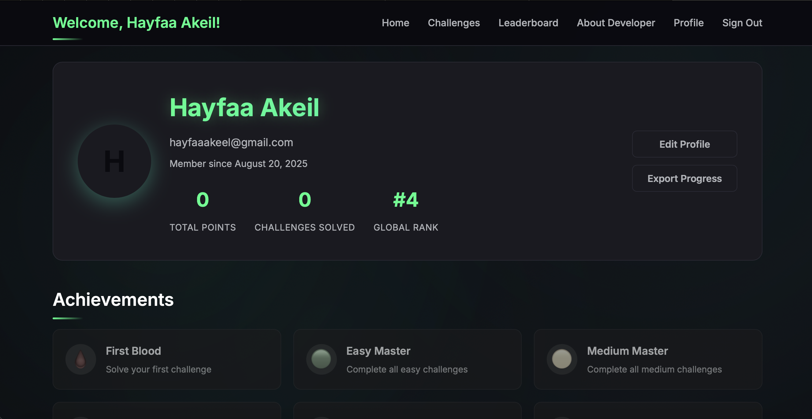

# FlagHunt3rs

**FlagHunt3rs** is a professional **MEAN Full-Stack Capture the Flag (CTF) platform** developed as part of the *ITE410 – Web Programming* course. The platform is designed to introduce beginner and aspiring CTF enthusiasts to the fundamentals of cybersecurity by providing a practical environment where they can practice, solve challenges, and compete on a leaderboard.

---

## 📌 Problem Statement
Cybersecurity competitions are a proven way to engage learners in practical security training. However, most existing platforms are either too advanced for beginners or inaccessible for younger students. This project addresses the need for a beginner-friendly, full-stack CTF platform where students can **sign up, attempt challenges, capture flags, and track their progress**.

---

## 🎯 Objectives
- Develop an end-to-end **MEAN full stack** interactive web application.
- Provide an **authentication system** (sign up, login, persistent sessions).
- Create and manage **CTF challenges** with flag submission and scoring.
- Implement a **real-time leaderboard** and user profiles.
- Store all data persistently in **MongoDB**.
- Deploy the platform to a cloud server (**Heroku**) for public access.
- Demonstrate usage of **AJAX, JSON, and REST APIs** for smooth interactivity.

---

## 🛠️ Technology Stack
- **Frontend**
  - HTML5, CSS3, Bootstrap
  - JavaScript (Object-Oriented, DOM manipulation, AJAX)
- **Backend**
  - Node.js with Express.js
  - RESTful API for authentication, challenges, and leaderboard
- **Database**
  - MongoDB Atlas (NoSQL database)
- **Authentication**
  - Sessions with `express-session` and MongoDB store
  - Password hashing with `bcryptjs`
- **Deployment**
  - Hosted on **Heroku** with persistent MongoDB Atlas connection

---

## 🏗️ System Architecture
- **Client-Side (Browser):** HTML/CSS/JS pages served from the `public/` folder.
- **Server-Side (Express):** Handles routes for authentication, challenges, and leaderboard.
- **Database (MongoDB):** Stores user accounts, challenges, submissions, and leaderboard stats.
- **AJAX + JSON:** Used for asynchronous communication between client and server (e.g., flag submissions, login validation).

---

## 🌐 Key Features
-  **User Authentication** – secure sign up/login with session-based persistence.  
-  **Challenges Module** – multiple challenge categories and difficulties (easy, medium, hard).  
-  **Leaderboard** – dynamic scoring system that ranks users globally.  
-  **Profile Page** – view solved challenges and total points.  
-  **About Developers Page** – team info and project background.  
-  **AJAX & JSON** – interactive flag submission without page reload.  
-  **Cloud Deployment** – live site hosted on **Heroku** with MongoDB Atlas.  

---

## 📸 Screenshots

### Homepage

### Sign Up Empty

### Sign Up Full

### Challenges Page

### Leaderboard

### About Developers

### Profile

---

## ⚙️ Implementation Details
- Challenges and flags are stored in MongoDB and validated server-side.  
- Each submission is verified, and scores are updated in both the user profile and leaderboard.  
- Passwords are hashed using **bcryptjs** for security.  
- Sessions are stored in MongoDB using **connect-mongo**, allowing users to log in across devices.  
- A `.gitignore` file ensures sensitive files like `.env` and `node_modules/` are not exposed on GitHub.  

---

## 🚀 Deployment
- Hosted on **Heroku** with continuous deployment enabled.  
- MongoDB Atlas used as the remote database.  
- Application URL: *https://flaghunt3rs-app-b03c5a89a81c.herokuapp.com*  

---

## 🧪 Testing & Debugging
- Tested flag submissions with correct and incorrect answers.  
- Verified session persistence across browsers and devices.  
- Ensured leaderboard updates reflect deductions when hints are used.  
- Edge cases: duplicate signups, invalid flags, and empty submissions handled gracefully.  

---

## 💡 Challenges & Solutions
- **Session conflicts between frontend and backend** → solved by unifying all authentication on the backend with MongoDB + sessions.  
- **Leaderboard not updating properly with hint deductions** → fixed by adjusting backend score updates before storing to MongoDB.  
- **Deployment issues on Heroku** → resolved by using `dotenv` for environment variables and connecting with MongoDB Atlas URI.  

---

## 📚 References
- MongoDB Documentation – https://www.mongodb.com/docs  
- Express.js Documentation – https://expressjs.com/  
- Heroku Deployment Guide – https://devcenter.heroku.com/  

---

## 👨‍💻 Developer
- *Hayfaa Akeil* : Backend development - Frontend design - database design - AJAX integration - Challenge creation & testing
